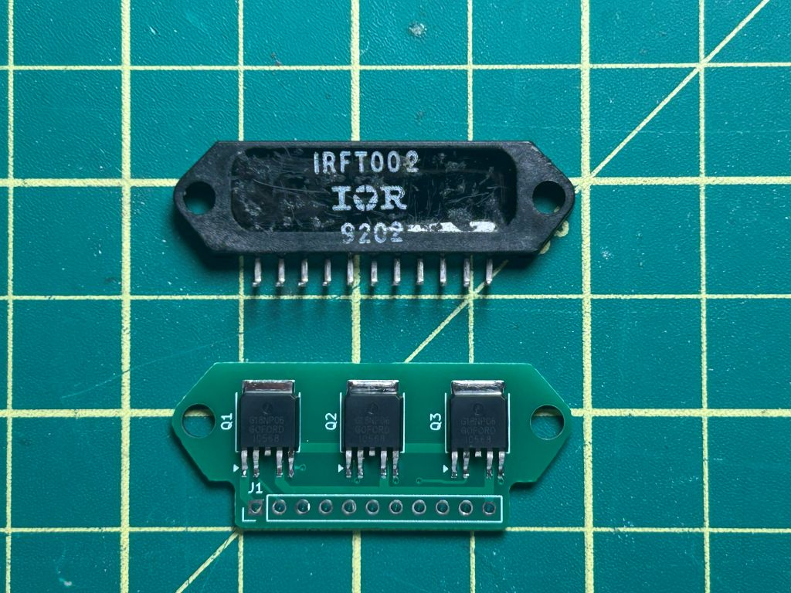

# IRFT002-module KICAD project

The [IRFT002 HEXFET Power Module](IRFT002.pdf) was commonly used in the mid-90s for hard drive spindle motor control. Typical drive models include the MAXTOR XT-8760 series of drives. Decades later, many of these modules have failed either due to overload/overheat or contamination from adjacent leaking electrolytic capacitors.

Since this device is now unobtainium I designed this PCB module as a (mostly) drop-in replacement part using modern devices, specifically the [Goford Semiconductor G18NP06Y](https://www.gofordsemi.com/upload/cn/propdf/G18NP06Y.pdf). 
Advances in semiconductor technology make these MOSFETs superior to the original IRFT002 in every way (higher continuous current, lower Rds, etc.).

